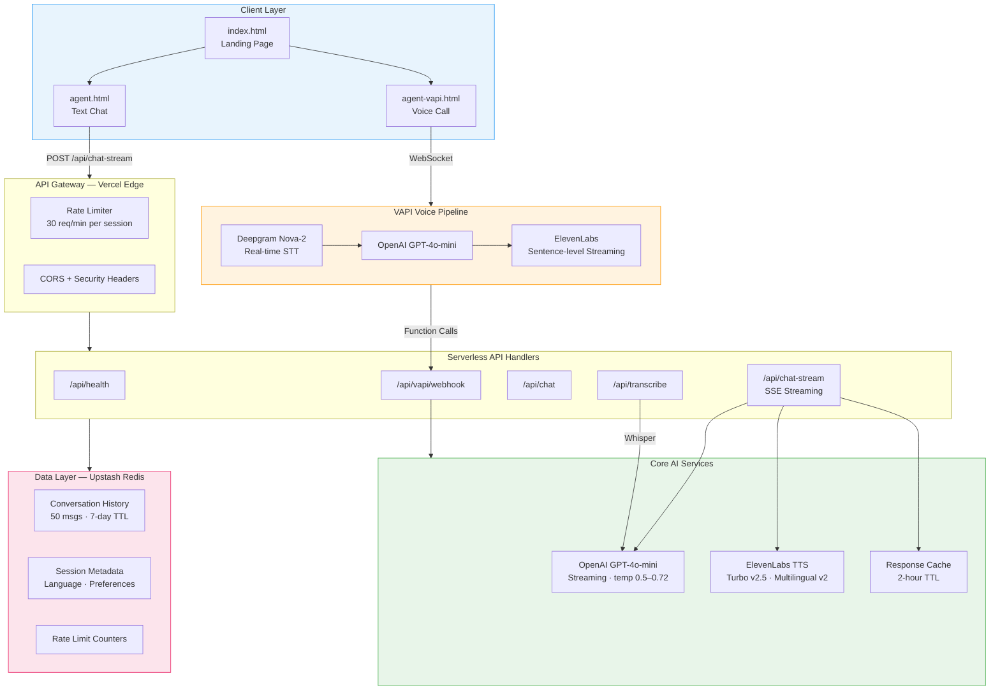
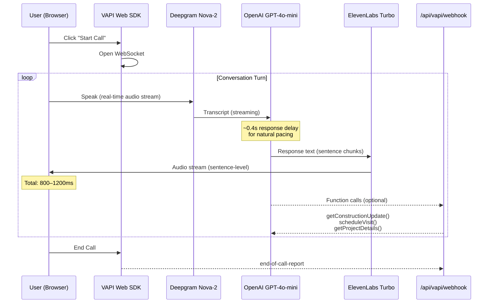
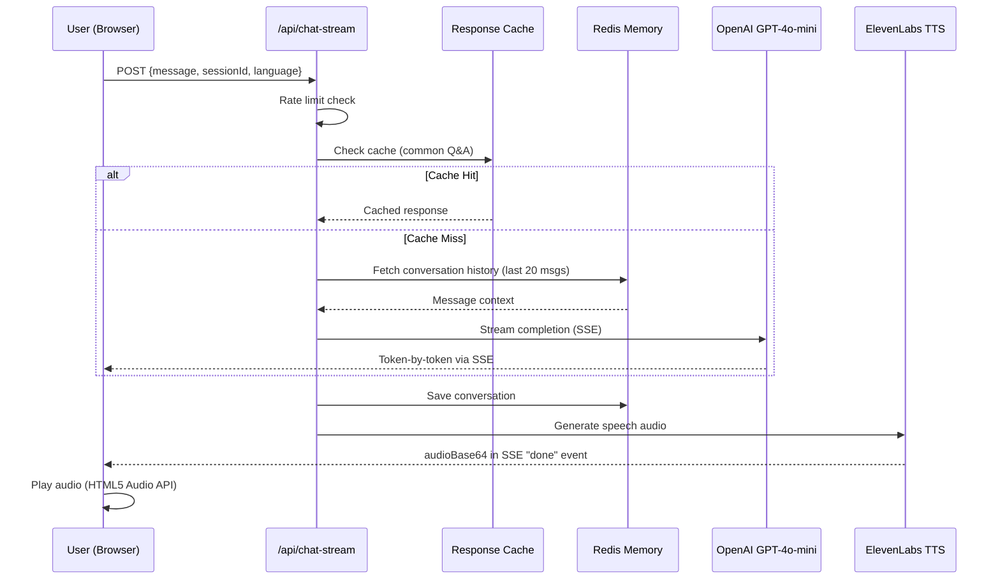
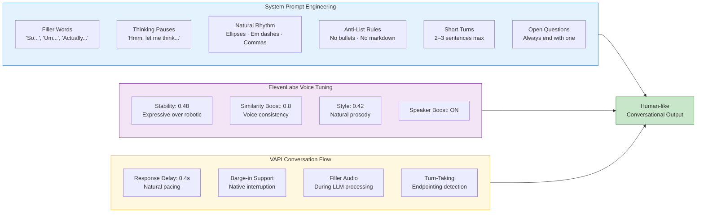
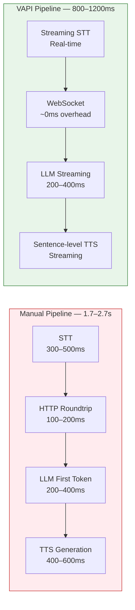
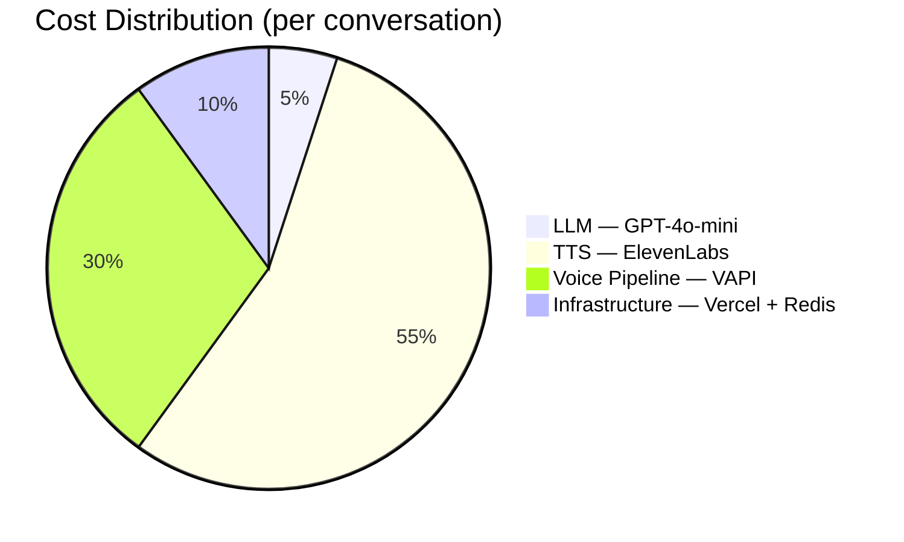

# Riverwood Estate AI Voice Agent

Production-grade conversational AI voice agent for **Riverwood Estate** (Riverwood Projects LLP) — a 15.5-acre DDJAY-licensed premium residential township in Sector-7, Kharkhauda, Sonipat, Haryana.

**Agent Persona:** Priya — a warm, multilingual conversational agent who provides construction updates, answers project questions, and schedules site visits in **English**, **Hindi**, and **Marathi** with human-like voice interaction.

---

## System Architecture



---

## Voice Call Pipeline (VAPI)

The primary interaction mode — browser-based voice calls with sub-1.2s end-to-end latency.



---

## Text Chat Pipeline (SSE Streaming)

Streaming text responses with parallel TTS audio generation.



---

## Voice Realism Architecture

The system is engineered for natural, human-like voice interaction — the primary evaluation dimension.



---

## Latency Optimization



| Optimization | Technique | Impact |
|---|---|---|
| **Streaming LLM** | SSE + `gpt-4o-mini` | First token in ~200ms |
| **Turbo TTS** | ElevenLabs `eleven_turbo_v2_5` | ~50% faster than standard |
| **WebSocket** | VAPI persistent connection | Eliminates HTTP overhead |
| **Response Cache** | Common Q&A cached (2hr TTL) | Instant for repeat queries |
| **Edge Deployment** | Vercel Edge Functions | Low-latency globally |

---

## Cost Efficiency



| Strategy | Implementation | Savings |
|---|---|---|
| **Lightweight LLM** | `gpt-4o-mini` instead of GPT-4 | ~95% LLM cost reduction |
| **Response Caching** | Redis cache for common queries (2hr TTL) | ~20% fewer LLM/TTS calls |
| **Rate Limiting** | 30 req/min per session | Prevents abuse |
| **Token Limits** | 150–250 max tokens per response | Controls LLM spend |
| **Optional Redis** | In-memory fallback for dev | $0 storage in development |

---

## Tech Stack

| Layer | Technology | Purpose |
|---|---|---|
| **LLM** | OpenAI GPT-4o-mini | Conversation intelligence (streaming) |
| **Voice Calls** | VAPI Web SDK | Real-time STT → LLM → TTS pipeline |
| **STT** | Deepgram Nova-2 (via VAPI) | Real-time speech transcription |
| **TTS (Primary)** | ElevenLabs Turbo v2.5 / Multilingual v2 | Natural voice synthesis |
| **TTS (Fallback)** | OpenAI TTS (`tts-1`, `shimmer`) | Dev-only fallback |
| **Memory** | Upstash Redis | Conversation history, caching, rate limits |
| **Hosting** | Vercel (Serverless) | Edge-deployed API handlers |
| **Frontend** | Vanilla HTML/CSS/JS | Zero-framework, fast loading |

---

## Quick Start

```bash
git clone <repo-url>
cd <project-folder>
npm install
cp .env.example .env
# Fill in your API keys (see below)
npm run dev
```

Open **http://localhost:3000**

| Page | URL | Description |
|---|---|---|
| Landing | `/` | Hero + CTA buttons |
| Text Chat | `/agent.html` | Streaming chat with TTS playback |
| Voice Call | `/agent-vapi.html` | Live voice call (requires mic access) |

> Use an HTTP URL — **not** `file://` — so API endpoints resolve correctly.

### Environment Variables

| Variable | Required | Description |
|---|---|---|
| `OPENAI_API_KEY` | Yes | OpenAI API key (`sk-` or `sk-proj-`) |
| `ELEVENLABS_API_KEY` | Yes (prod) | ElevenLabs TTS API key |
| `ELEVENLABS_VOICE_ID` | No | English voice ID (default provided) |
| `ELEVENLABS_VOICE_ID_HI` | No | Hindi voice ID |
| `ELEVENLABS_VOICE_ID_MR` | No | Marathi voice ID |
| `VAPI_PUBLIC_KEY` | Yes (voice) | VAPI public key for Web SDK |
| `VAPI_ASSISTANT_ID` | Yes (voice) | VAPI assistant UUID |
| `UPSTASH_REDIS_REST_URL` | No | Redis URL (recommended for prod) |
| `UPSTASH_REDIS_REST_TOKEN` | No | Redis auth token |

See [.env.example](.env.example) for the full template.

---

## API Endpoints

| Endpoint | Method | Description |
|---|---|---|
| `/api/health` | GET | Config status, feature flags, VAPI credentials |
| `/api/chat-stream` | POST | SSE streaming chat + TTS audio |
| `/api/chat` | POST | Single-response chat (non-streaming) |
| `/api/transcribe` | POST | Whisper STT (multipart audio upload) |
| `/api/vapi/webhook` | POST | VAPI event handler + function calls |

---

## Project Structure

```
.
├── api/
│   ├── _lib/
│   │   ├── cache.js          # Response cache (Redis + in-memory)
│   │   ├── env.js            # Environment validation
│   │   ├── knowledge.js      # Project knowledge base
│   │   ├── redis.js          # Conversation memory + rate limiting
│   │   ├── storage.js        # In-memory storage fallback
│   │   ├── tts.js            # ElevenLabs + OpenAI TTS
│   │   └── voice-prompt.js   # Voice-optimized system prompts
│   ├── vapi/
│   │   ├── webhook.js        # VAPI event + function call handler
│   │   └── outbound-call.js  # Outbound call trigger
│   ├── chat.js               # Non-streaming chat
│   ├── chat-stream.js        # SSE streaming chat + TTS
│   ├── health.js             # Health check endpoint
│   └── transcribe.js         # Whisper transcription
├── js/
│   ├── agent.js              # Text chat frontend (SSE + Web Speech)
│   └── agent-vapi.js         # Voice call frontend (VAPI Web SDK)
├── css/
│   └── style.css             # Design system
├── index.html                # Landing page
├── agent.html                # Text chat page
├── agent-vapi.html           # Voice call page
├── server.js                 # Local dev server
├── vercel.json               # Deployment config
├── ARCHITECTURE.md           # Extended design notes
└── .env.example              # Environment template
```

---

## VAPI Web SDK Notes

`agent-vapi.html` loads `@vapi-ai/web` v2.5.2 from jsDelivr ESM. The bundle's default export is a module namespace; the client class is on `.default`.

**Dashboard vs inline config:** When `VAPI_ASSISTANT_ID` is set, the browser sends minimal `assistantOverrides` (`firstMessage` + `model` only). Voice, STT, and language settings must be configured in the **VAPI dashboard**. Without an assistant ID, the app uses a full inline assistant definition from `js/agent-vapi.js`.

**Troubleshooting:** If `POST …/call/web` returns 400, check that your dashboard assistant uses `gpt-4o-mini` with matching temperature/token settings. See `js/agent-vapi.js` for the exact `VAPI_MODEL_SETTINGS`.

---

## Deployment

**Vercel (recommended):**

```bash
npx vercel --prod
```

Set the same environment variables in your Vercel project dashboard. For local Vercel parity: `npx vercel dev`.

**Features:**
- Serverless functions with 30s timeout
- Security headers (X-Content-Type-Options, X-Frame-Options: DENY)
- Edge deployment for global low latency

---

## Languages

| Language | TTS Model | Voice Config |
|---|---|---|
| English | `eleven_turbo_v2_5` | `ELEVENLABS_VOICE_ID` |
| Hindi | `eleven_multilingual_v2` | `ELEVENLABS_VOICE_ID_HI` |
| Marathi | `eleven_multilingual_v2` | `ELEVENLABS_VOICE_ID_MR` |

Language selection available in both text chat and voice call interfaces. Browser Web Speech API provides fallback STT with native `en-IN`, `hi-IN`, `mr-IN` support.
